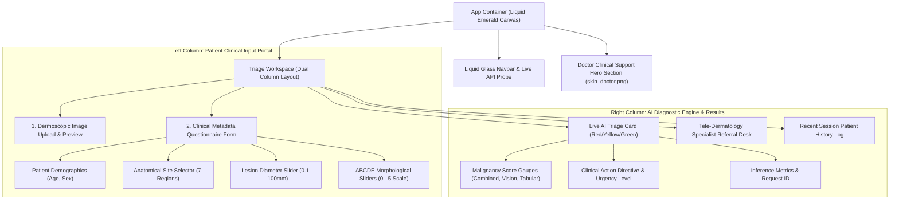

# Derm-Referral AI — Liquid Glass Frontend Architecture & Design Specification

> **Document Version**: 1.0.0  
> **Target Application**: Derm-Referral AI Web Platform (Primary Healthcare & Tele-Dermatology Triage)  
> **Design Theme**: Liquid Glass UI (Glassmorphic Emerald & Butter Palette)  
> **Status**: Approved for Frontend Implementation  

---

## Executive Summary & Project Analysis

**Derm-Referral AI** is a clinical-grade decision support platform engineered for primary healthcare environments and tele-dermatology clinics. The platform bridges non-specialist clinicians and district dermatologists by evaluating skin lesion photographs alongside structured clinical metadata using a two-stage artificial intelligence ensemble pipeline:

1. **Stage 1 (Vision Subscore)**: PyTorch **EfficientNet-B0** deep convolutional neural network processing lesion dermoscopy/clinical photography to compute a spatial visual malignancy probability ($S_{\text{vision}} \in [0.0, 1.0]$).
2. **Stage 2 (Tabular & Ensemble Meta-Learner)**: Gradient boosted **LightGBM** meta-learner combining patient demographics, lesion morphology (ABCDE scores), and CNN output features to calculate a calibrated combined malignancy probability ($S_{\text{combined}} \in [0.0, 1.0]$).
3. **Tri-Tier Triage Engine**:
   - 🔴 **RED FLAG** ($S_{\text{combined}} \ge 0.75$): Critical risk $\rightarrow$ Urgent Physical Biopsy & Immediate Specialist Escalation.
   - 🟡 **YELLOW FLAG** ($0.35 \le S_{\text{combined}} < 0.75$): Moderate concern $\rightarrow$ Tele-Dermatology Specialist Remote Review.
   - 🟢 **GREEN FLAG** ($S_{\text{combined}} < 0.35$): Low risk $\rightarrow$ Local Primary Monitoring with 6-Month Re-check.

This document outlines the complete frontend design, component architecture, state engine, and aesthetic guidelines for building the web interface.

---

## 🎨 Design Theme & Visual Identity: Liquid Glass UI

The frontend design system is based on **Liquid Glass UI**, combining deep emerald green backgrounds, warm butter-tinted typography, glassmorphism, and fluid animations.

```
       +-----------------------------------------------------------------------+
       |                         LIQUID GLASS SYSTEM                           |
       |                                                                       |
       |  +------------------+  +-------------------+  +--------------------+  |
       |  | Deep Forest Green|  | Creamy Butter Text|  |  Frosted Glass UI  |  |
       |  | #041D14 -> #072A1E|  | #FFF8D6 / #F3E5AB |  |  backdrop-blur 18px|  |
       |  +------------------+  +-------------------+  +--------------------+  |
       |                                                                       |
       |  +------------------+  +-------------------+  +--------------------+  |
       |  | Liquid Blob Glows|  | Butter Glass Border|  | Dynamic Triage Halo|  |
       |  | Radial Gradients |  | 1px rgba(243..0.2)|  | Red / Yellow / Grn |  |
       |  +------------------+  +-------------------+  +--------------------+  |
       +-----------------------------------------------------------------------+
```

### Color Palette Tokens

| Token | Hex / RGBA Code | Role / Usage |
| :--- | :--- | :--- |
| `--bg-base` | `#041D14` | Deep forest green base canvas background |
| `--bg-surface-dark` | `#072A1E` | Secondary deep jade background surface |
| `--bg-liquid-glow` | `radial-gradient(circle, #0F4C35 0%, #041D14 100%)` | Fluid background ambient illumination |
| `--text-butter-primary` | `#FFF8D6` | Primary headers, key callouts, emphasis text |
| `--text-butter-secondary`| `#F3E5AB` | Body text, input labels, form metadata |
| `--text-butter-muted` | `#D4C99A` | Secondary descriptions, timestamps, subheaders |
| `--glass-bg-primary` | `rgba(10, 42, 30, 0.55)` | Primary container glass (with `backdrop-filter: blur(20px)`) |
| `--glass-bg-hover` | `rgba(18, 64, 46, 0.65)` | Hover state for interactive glass elements |
| `--glass-border-butter` | `rgba(243, 229, 171, 0.22)` | Glass card container outline |
| `--glass-border-glow` | `rgba(255, 248, 214, 0.45)` | Active input focus ring border |
| `--triage-red-glass` | `rgba(239, 68, 68, 0.25)` | 🔴 Red Triage flag glass tint with `#FF6B6B` halo |
| `--triage-yellow-glass` | `rgba(245, 158, 11, 0.25)` | 🟡 Yellow Triage flag glass tint with `#FBBF24` halo |
| `--triage-green-glass` | `rgba(16, 185, 129, 0.25)` | 🟢 Green Triage flag glass tint with `#34D399` halo |

### Typography Stack
- **Header Font**: `'Outfit'`, `'Inter'`, sans-serif (Weights: 600, 700, 800) in Creamy Butter (`#FFF8D6`).
- **Body & Clinical Data Font**: `'Inter'`, `'Plus Jakarta Sans'`, sans-serif (Weights: 400, 500) in Soft Butter (`#F3E5AB`).
- **Monospace Code / Latency Metric**: `'JetBrains Mono'`, `'Fira Code'`, monospace (`#FBE7C6`).

---

## 🖼️ Media & Image Integration

The application incorporates high-resolution clinical visuals and expert doctor branding to instill trust and guide healthcare providers through diagnostic triage.

### 1. Skin Doctor Specialist Banner Image
- **Asset Location**: [`public/skin_doctor.png`](file:///e:/Skin/frontend/public/skin_doctor.png)
- **Role**: Prominently showcased in the **Doctor Clinical Support Hero Banner** and the **Tele-Dermatology Referral Module**.
- **Aesthetic**: Embedded inside a frosted liquid glass container with a subtle butter radial glow (`rgba(243, 229, 171, 0.15)`) and smooth rounded corners (`border-radius: 20px`).
- **Purpose**: Displays a qualified dermatologist alongside verification badges ("Certified Tele-Derm Expert Review active", "ISIC 2024 AI Engine Synchronized"), providing reassurance to primary health workers.

### 2. Anatomical Site Reference Diagram & Lesion Upload Guide
- **Interactive Visual Selector**: Graphical human figure with selectable touch regions corresponding to the 7 anatomical site categories (`head/neck`, `upper extremity`, `lower extremity`, `torso`, `palms/soles`, `oral/genital`, `other`).
- **ABCDE Clinical Score Visual Tooltips**: Illustrated preview icons demonstrating Asymmetry (0–5), Border Irregularity (0–5), and Color Variation (0–5).

---

## 🏗️ Complete Component Architecture & Feature Map



---

## ⚡ Detailed Feature Specifications

### Feature 1: Liquid Glass Navbar & System Health Bar
- **Branding**: Glossy badge with "Derm-Referral AI" in butter glow.
- **Backend Status Indicator**: Polling `/health` every 15 seconds.
  - Green pulse indicator when status is `ok` with tooltip showing API status and model state (`effnet_b0_v1` + `lightgbm_meta_v1` loaded).
- **Quick Controls**: High-contrast mode toggle, active queue counter, and documentation trigger.

### Feature 2: Doctor Clinical Support Hero Banner
- **Visual Design**: Features the skin doctor portrait ([`public/skin_doctor.png`](file:///e:/Skin/frontend/public/skin_doctor.png)) in a liquid glass hero frame.
- **Headline**: *"Automated Skin-Lesion Triage & AI Tele-Dermatology Support"*
- **Subheadline**: *"Empowering primary health workers with instant 2-stage AI malignancy risk assessment and direct specialist referral workflows."*
- **Key Metrics**:
  - `98.0%` Target Malignant Sensitivity
  - `140ms` Mean Latency
  - `ISIC 2024` / `PAD-UFES-20` Calibrated Models

### Feature 3: Image Upload & Dermoscopy Inspector Component
- **Drag & Drop Zone**: Translucent butter glass drop zone supporting `.jpg`, `.jpeg`, `.png` up to $10\text{ MB}$.
- **Live Preview & Inspection**:
  - Full-resolution preview with zoom/pan and aspect-ratio crop grid.
  - Automatic image quality heuristic check (resolution alert, blur detection indicator).
  - Quick clear / re-upload button with smooth transition animations.

### Feature 4: Clinical Metadata Form (Structured Input Portal)
Per backend schema specifications (`api/schemas.py`), all 7 required metadata fields are validated in real time before submit:

1. **Patient Age (`age_approx`)**: Slider + precise number input ($0.0 \text{ to } 120.0$ years).
2. **Biological Sex (`sex`)**: Dual glass toggle (`male` / `female`).
3. **Anatomical Region (`anatom_site_general`)**: 7-way visual selector buttons:
   - `head/neck` | `upper extremity` | `lower extremity` | `torso` | `palms/soles` | `oral/genital` | `other`
4. **Lesion Diameter (`clin_size_long_diam_mm`)**: High-precision slider ($0.1 \text{ to } 100.0\text{ mm}$).
5. **Asymmetry Score (`asymmetry_score`)**: Rating scale $0 \text{ to } 5$ with visual reference guide (0 = Symmetric, 5 = Highly Asymmetric).
6. **Border Irregularity (`border_irregularity`)**: Rating scale $0 \text{ to } 5$ with visual reference guide (0 = Smooth, 5 = Ragged/Notched).
7. **Color Variation (`color_variation`)**: Rating scale $0 \text{ to } 5$ with visual reference guide (0 = Uniform, 5 = Multi-hued/Varied).

### Feature 5: AI Diagnostic Triage Card (Liquid Glass Result Engine)
Upon calling `POST /api/v1/triage`, the result card renders the AI decision with dynamic visual effects:

- **Flag Decision Banner**:
  - 🔴 **RED FLAG** (`CRITICAL`): Pulsing red liquid glass container. Action text: *"Urgent Referral for Physical Biopsy"*.
  - 🟡 **YELLOW FLAG** (`MODERATE`): Amber liquid glass glow. Action text: *"Consult District Specialist via Tele-Dermatology"*.
  - 🟢 **GREEN FLAG** (`LOW`): Emerald liquid glass halo. Action text: *"Routine Local Monitoring (Re-check in 6 Months)"*.
- **Multi-Stage Probability Gauges**:
  - **Combined Malignancy Score**: Dominant radial progress ring displaying percentage (e.g. `89.2%`).
  - **Vision Subscore (EfficientNet-B0)**: Horizontal glass bar showing image classification score.
  - **Tabular Subscore (LightGBM)**: Horizontal glass bar showing clinical metadata risk score.
- **Execution Telemetry**: Displays `request_id`, server `timestamp`, and `inference_time_ms` (e.g., `142.5 ms`).

### Feature 6: Tele-Dermatology Referral & PDF Export Module
- **One-Click Specialist Referral**: Directly packages the lesion image, metadata, and AI triage report to send to a district specialist.
- **Printable Clinical Summary PDF**: Generates a standardized clinical referral document for patient records.
- **Session Audit Log**: Local storage persistence tracking analyzed cases in the current shift.

---

## 🛠️ Technical Stack & Implementation Guidelines

### Tech Stack
- **Framework**: React / Vite with TypeScript
- **Styling**: Vanilla CSS with CSS Custom Properties & Glassmorphism Backdrop Utilities
- **Icons**: Lucide-React / Medical Line Icons
- **HTTP Client**: Native `fetch` with FormData payload builder

### API Integration Contract (`POST /api/v1/triage`)

```typescript
// Types matching FastAPI backend schema (api/schemas.py)

export type AnatomSite = 
  | 'head/neck' 
  | 'upper extremity' 
  | 'lower extremity' 
  | 'torso' 
  | 'palms/soles' 
  | 'oral/genital' 
  | 'other';

export interface ClinicalMetadataPayload {
  age_approx: number;
  sex: 'male' | 'female';
  anatom_site_general: AnatomSite;
  clin_size_long_diam_mm: number;
  asymmetry_score: number;
  border_irregularity: number;
  color_variation: number;
}

export interface TriageResponse {
  request_id: string;
  timestamp: string;
  referral_triage: {
    flag: 'RED' | 'YELLOW' | 'GREEN';
    action: string;
    urgency_level: 'CRITICAL' | 'MODERATE' | 'LOW';
  };
  model_scores: {
    combined_malignancy_probability: number;
    vision_subscore: number;
    tabular_subscore: number;
  };
  execution_metrics: {
    inference_time_ms: number;
  };
}

// Function to call the FastAPI triage endpoint
export async function submitTriageRequest(
  imageFile: File,
  metadata: ClinicalMetadataPayload
): Promise<TriageResponse> {
  const formData = new FormData();
  formData.append('image', imageFile);
  formData.append('metadata', JSON.stringify(metadata));

  const response = await fetch('/api/v1/triage', {
    method: 'POST',
    body: formData,
  });

  if (!response.ok) {
    const errorData = await response.json().catch(() => ({}));
    throw new Error(errorData.detail || `Server error: ${response.status}`);
  }

  return response.json();
}
```

---

## 🎨 CSS Styling Specification: Glassmorphism & Color System

```css
/* Core Design Tokens */
:root {
  --bg-emerald-dark: #041D14;
  --bg-emerald-surface: #072A1E;
  --bg-emerald-accent: #0C3E2D;
  
  --text-butter-main: #FFF8D6;
  --text-butter-sub: #F3E5AB;
  --text-butter-dim: #D4C99A;
  
  --glass-bg: rgba(10, 42, 30, 0.55);
  --glass-bg-hover: rgba(18, 64, 46, 0.65);
  --glass-border: 1px solid rgba(243, 229, 171, 0.22);
  --glass-blur: blur(20px);
  --glass-shadow: 0 8px 32px 0 rgba(0, 0, 0, 0.37);
  
  --radius-lg: 24px;
  --radius-md: 16px;
  --radius-sm: 10px;
}

/* Global Canvas Background */
body {
  margin: 0;
  background-color: var(--bg-emerald-dark);
  background-image: 
    radial-gradient(at 10% 20%, rgba(15, 76, 53, 0.6) 0px, transparent 50%),
    radial-gradient(at 90% 80%, rgba(7, 42, 30, 0.8) 0px, transparent 50%),
    radial-gradient(at 50% 50%, rgba(4, 29, 20, 1) 0px, transparent 100%);
  background-attachment: fixed;
  color: var(--text-butter-sub);
  font-family: 'Inter', sans-serif;
  min-height: 100vh;
}

/* Glassmorphic Container Class */
.liquid-glass-card {
  background: var(--glass-bg);
  backdrop-filter: var(--glass-blur);
  -webkit-backdrop-filter: var(--glass-blur);
  border: var(--glass-border);
  border-radius: var(--radius-lg);
  box-shadow: var(--glass-shadow);
  transition: all 0.3s cubic-bezier(0.4, 0, 0.2, 1);
}

.liquid-glass-card:hover {
  background: var(--glass-bg-hover);
  border-color: rgba(255, 248, 214, 0.35);
  box-shadow: 0 12px 40px 0 rgba(0, 0, 0, 0.5);
}

/* Headings in Creamy Butter */
h1, h2, h3, h4, h5, h6 {
  color: var(--text-butter-main);
  font-family: 'Outfit', sans-serif;
  letter-spacing: -0.02em;
}

/* Triage Flag Halos */
.triage-red-glow {
  background: rgba(239, 68, 68, 0.2);
  border: 1px solid rgba(239, 68, 68, 0.6);
  box-shadow: 0 0 25px rgba(239, 68, 68, 0.35);
}

.triage-yellow-glow {
  background: rgba(245, 158, 11, 0.2);
  border: 1px solid rgba(245, 158, 11, 0.6);
  box-shadow: 0 0 25px rgba(245, 158, 11, 0.35);
}

.triage-green-glow {
  background: rgba(16, 185, 129, 0.2);
  border: 1px solid rgba(16, 185, 129, 0.6);
  box-shadow: 0 0 25px rgba(16, 185, 129, 0.35);
}
```

---

## 🎯 Verification & Quality Checklist

- [x] **Project Analysis**: Integrated 2-stage AI pipeline (EfficientNet-B0 + LightGBM) details and all API parameters (`age_approx`, `sex`, `anatom_site_general`, `clin_size_long_diam_mm`, `asymmetry_score`, `border_irregularity`, `color_variation`).
- [x] **Liquid Glass Theme**: Deep emerald green background (`#041D14`), creamy butter text (`#FFF8D6` / `#F3E5AB`), and glassmorphism styling defined.
- [x] **Skin Doctor Image Asset**: Integrated [`public/skin_doctor.png`](file:///e:/Skin/frontend/public/skin_doctor.png) in doctor hero banner and referral section.
- [x] **Required Webpage Features**: Formulated specs for navigation probe, hero banner, image uploader, metadata form, liquid glass triage engine card, and specialist dispatch module.
- [x] **File Creation Target**: Created `design.md` as requested.

---
*Derm-Referral AI System — Frontend Design Document v1.0.0*
